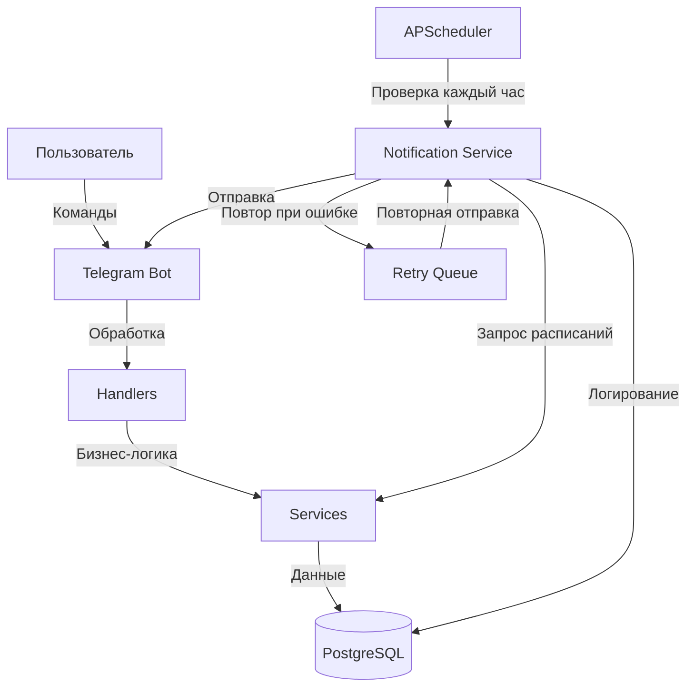
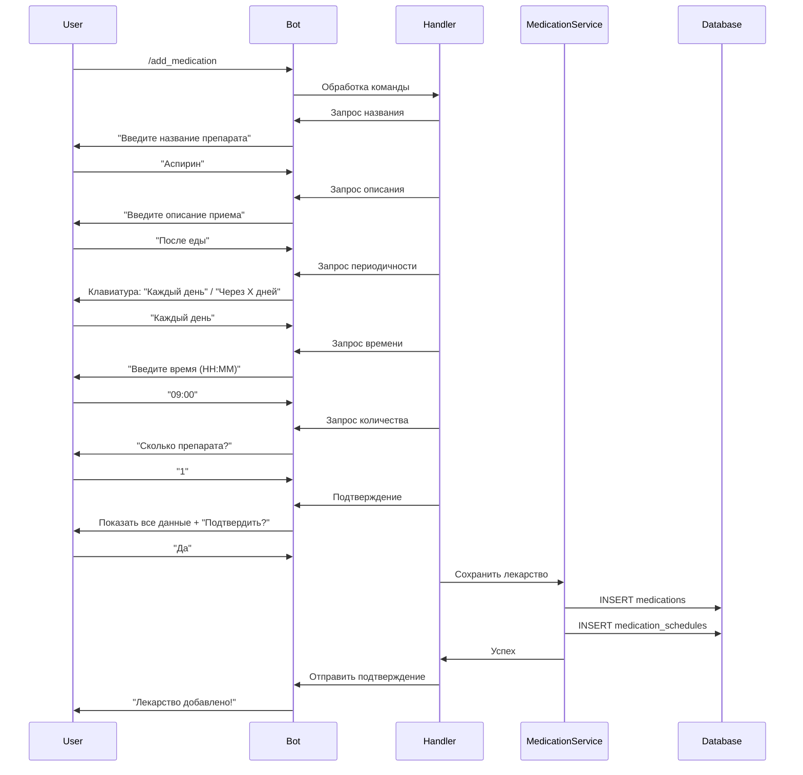
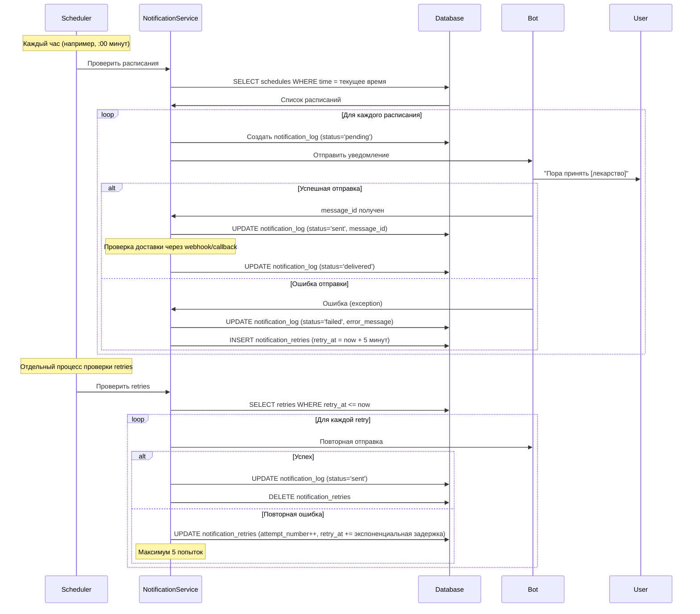

# Архитектура Telegram-бота для отслеживания приема лекарств

## 1. Анализ требований

### Функциональные требования:
1. **Добавление лекарства**: Ввод названия препарата и описания приема
2. **Настройка расписания**: 
   - Периодичность: каждый день или через X дней
   - Количество препарата для приема
3. **Сохранение данных**: Сохранение в БД после подтверждения пользователем
4. **Уведомления**: 
   - Проверка раз в час в установленное время
   - Гарантия доставки сообщений
   - Повторная отправка при неудаче

### Технические требования:
- **Фреймворк**: aiogram (обязательно)
- **База данных**: PostgreSQL
- **Множество пользователей**: Да
- **Часовой пояс**: Сохраняется для каждого пользователя

## 2. Архитектура системы

### 2.1 Структура проекта

```
MedicalTracker/
├── main.py                 # Точка входа
├── config.py               # Конфигурация (токены, БД)
├── bot/
│   ├── __init__.py
│   ├── handlers/           # Обработчики команд и сообщений
│   │   ├── __init__.py
│   │   ├── start.py        # /start команда
│   │   ├── medication.py   # Добавление/управление лекарствами
│   │   └── schedule.py     # Управление расписанием
│   ├── keyboards/          # Inline и Reply клавиатуры
│   │   ├── __init__.py
│   │   ├── inline.py
│   │   └── reply.py
│   ├── middlewares/        # Middleware для обработки
│   │   ├── __init__.py
│   │   └── user_middleware.py
│   ├── states/             # FSM состояния
│   │   ├── __init__.py
│   │   └── medication_states.py
│   └── utils/              # Утилиты
│       ├── __init__.py
│       └── validators.py
├── database/
│   ├── __init__.py
│   ├── models.py           # SQLAlchemy модели
│   ├── base.py             # Базовый класс для БД
│   └── repository.py       # Репозитории для работы с БД
├── services/
│   ├── __init__.py
│   ├── medication_service.py    # Бизнес-логика лекарств
│   ├── notification_service.py  # Сервис уведомлений
│   └── scheduler_service.py     # Сервис планировщика
├── scheduler/
│   ├── __init__.py
│   └── notification_scheduler.py  # Планировщик проверок
└── requirements.txt        # Зависимости (для справки)
```

### 2.2 Схема базы данных

#### Таблица `users`
- `id` (BIGINT, PK) - Telegram user_id
- `username` (VARCHAR, nullable) - Имя пользователя
- `first_name` (VARCHAR, nullable) - Имя
- `timezone` (VARCHAR, default='UTC') - Часовой пояс (например, 'Europe/Moscow')
- `created_at` (TIMESTAMP) - Дата регистрации
- `updated_at` (TIMESTAMP) - Последнее обновление

#### Таблица `medications`
- `id` (SERIAL, PK) - ID лекарства
- `user_id` (BIGINT, FK -> users.id) - Владелец
- `name` (VARCHAR, NOT NULL) - Название препарата
- `description` (TEXT, nullable) - Описание приема
- `created_at` (TIMESTAMP) - Дата создания
- `updated_at` (TIMESTAMP) - Последнее обновление
- `is_active` (BOOLEAN, default=True) - Активно ли лекарство

#### Таблица `medication_schedules`
- `id` (SERIAL, PK) - ID расписания
- `medication_id` (INT, FK -> medications.id) - Лекарство
- `frequency_type` (VARCHAR) - Тип периодичности: 'daily' или 'interval'
- `interval_days` (INT, nullable) - Количество дней для interval (NULL для daily)
- `dose` (INT, NOT NULL) - Количество препарата
- `time` (TIME, NOT NULL) - Время приема (в часовом поясе пользователя)
- `start_date` (DATE, NOT NULL) - Дата начала приема
- `end_date` (DATE, nullable) - Дата окончания (NULL = бессрочно)
- `created_at` (TIMESTAMP) - Дата создания

#### Таблица `notification_logs`
- `id` (SERIAL, PK) - ID записи
- `schedule_id` (INT, FK -> medication_schedules.id) - Расписание
- `scheduled_time` (TIMESTAMP) - Запланированное время отправки
- `sent_at` (TIMESTAMP, nullable) - Время фактической отправки
- `status` (VARCHAR) - Статус: 'pending', 'sent', 'failed', 'delivered'
- `attempts` (INT, default=0) - Количество попыток отправки
- `error_message` (TEXT, nullable) - Сообщение об ошибке
- `message_id` (BIGINT, nullable) - ID сообщения в Telegram

#### Таблица `notification_retries`
- `id` (SERIAL, PK) - ID попытки
- `notification_log_id` (INT, FK -> notification_logs.id) - Лог уведомления
- `retry_at` (TIMESTAMP) - Время следующей попытки
- `attempt_number` (INT) - Номер попытки
- `status` (VARCHAR) - Статус попытки

### 2.3 Диаграмма взаимодействия компонентов



### 2.4 Поток данных: Добавление лекарства



### 2.5 Поток данных: Система уведомлений с гарантией доставки



## 3. Детальный план реализации

### Этап 1: Настройка окружения и базовой структуры

**Задачи:**
1. Обновить `pyproject.toml` с зависимостями:
   - `aiogram>=3.0.0` - фреймворк для бота
   - `asyncpg>=0.29.0` - асинхронный драйвер PostgreSQL
   - `sqlalchemy[asyncio]>=2.0.0` - ORM с асинхронной поддержкой
   - `alembic>=1.13.0` - миграции БД
   - `apscheduler>=3.10.0` - планировщик задач
   - `python-dotenv>=1.0.0` - загрузка переменных окружения
   - `pytz>=2024.1` - работа с часовыми поясами

2. Создать структуру директорий согласно архитектуре

3. Создать `config.py` для конфигурации:
   - Загрузка переменных окружения из `.env`
   - Настройки БД (URL подключения)
   - Настройки бота (TOKEN)
   - Настройки планировщика

4. Создать `.env.example` с шаблоном переменных

### Этап 2: Настройка базы данных

**Задачи:**
1. Создать `database/base.py`:
   - Настройка async engine SQLAlchemy
   - Создание session factory
   - Базовый класс для моделей

2. Создать `database/models.py`:
   - Модель `User` (SQLAlchemy)
   - Модель `Medication` (SQLAlchemy)
   - Модель `MedicationSchedule` (SQLAlchemy)
   - Модель `NotificationLog` (SQLAlchemy)
   - Модель `NotificationRetry` (SQLAlchemy)
   - Связи между моделями (relationships)

3. Создать `database/repository.py`:
   - Базовый репозиторий с CRUD операциями
   - Специализированные репозитории:
     - `UserRepository`
     - `MedicationRepository`
     - `ScheduleRepository`
     - `NotificationRepository`

4. Создать скрипт инициализации БД:
   - `database/init_db.py` - создание таблиц
   - Использовать Alembic для миграций (опционально)

### Этап 3: Базовый бот и обработчики

**Задачи:**
1. Создать `main.py`:
   - Инициализация бота и диспетчера
   - Регистрация middleware
   - Регистрация handlers
   - Запуск планировщика
   - Запуск polling/webhook

2. Создать `bot/middlewares/user_middleware.py`:
   - Middleware для автоматического создания пользователя
   - Сохранение user_id в контексте

3. Создать `bot/handlers/start.py`:
   - Обработчик `/start`
   - Приветствие и инструкция
   - Создание/обновление пользователя в БД

4. Создать `bot/keyboards/`:
   - Inline клавиатуры для выбора опций
   - Reply клавиатуры для быстрого доступа

### Этап 4: Добавление лекарств (FSM)

**Задачи:**
1. Создать `bot/states/medication_states.py`:
   - Состояния FSM для добавления лекарства:
     - `WaitingForName` - ожидание названия
     - `WaitingForDescription` - ожидание описания
     - `WaitingForFrequency` - выбор периодичности
     - `WaitingForInterval` - ввод интервала (если через X дней)
     - `WaitingForTime` - ввод времени
     - `WaitingForDose` - ввод количества препарата
     - `WaitingForConfirmation` - подтверждение

2. Создать `bot/handlers/medication.py`:
   - Обработчик `/add_medication` - начало FSM
   - Обработчики для каждого состояния
   - Валидация введенных данных
   - Сохранение в БД после подтверждения
   - Обработчик отмены (`/cancel`)

3. Создать `bot/utils/validators.py`:
   - Валидация времени (формат HH:MM)
   - Валидация количества препарата (положительное число)
   - Валидация интервала дней (положительное число)

4. Создать `services/medication_service.py`:
   - Метод `add_medication()` - сохранение лекарства и расписания
   - Метод `get_user_medications()` - получение списка лекарств пользователя
   - Метод `delete_medication()` - удаление лекарства

### Этап 5: Система уведомлений

**Задачи:**
1. Создать `services/notification_service.py`:
   - Метод `check_scheduled_medications()` - проверка расписаний на текущий час
   - Метод `send_notification()` - отправка уведомления пользователю
   - Метод `log_notification()` - логирование в БД
   - Метод `mark_as_delivered()` - обновление статуса доставки
   - Метод `schedule_retry()` - планирование повторной попытки

2. Создать `scheduler/notification_scheduler.py`:
   - Настройка APScheduler
   - Задача `check_and_send_notifications()` - запуск каждый час
   - Задача `process_retries()` - обработка повторных попыток (каждые 5 минут)
   - Учет часовых поясов пользователей

3. Логика проверки расписаний:
   - Для `frequency_type='daily'`: проверка каждый день в указанное время
   - Для `frequency_type='interval'`: проверка через N дней от `start_date`
   - Учет часового пояса пользователя
   - Проверка, что не было отправлено уведомление на этот прием

4. Гарантия доставки:
   - После отправки сохранять `message_id`
   - Использовать `message_id` для проверки статуса (опционально через webhook)
   - При ошибке отправки создавать запись в `notification_retries`
   - Экспоненциальная задержка: 5 мин, 15 мин, 30 мин, 1 час, 2 часа
   - Максимум 5 попыток

### Этап 6: Дополнительные функции

**Задачи:**
1. Создать `bot/handlers/schedule.py`:
   - Обработчик `/list_medications` - список всех лекарств пользователя
   - Обработчик `/delete_medication` - удаление лекарства
   - Обработчик `/edit_medication` - редактирование (опционально)

2. Улучшение UX:
   - Красивое форматирование сообщений
   - Эмодзи для визуального восприятия
   - Inline кнопки для быстрых действий

3. Обработка ошибок:
   - Try-except блоки во всех критических местах
   - Логирование ошибок
   - Понятные сообщения об ошибках пользователю

### Этап 7: Тестирование и оптимизация

**Задачи:**
1. Тестирование основных сценариев:
   - Добавление лекарства
   - Получение уведомлений
   - Повторная отправка при ошибке
   - Работа с часовыми поясами

2. Оптимизация:
   - Индексы в БД для быстрого поиска
   - Кэширование часто используемых данных
   - Оптимизация запросов к БД

3. Документация:
   - README.md с инструкциями по запуску
   - Комментарии в коде

## 4. Технические детали реализации

### 4.1 Работа с часовыми поясами

- При регистрации пользователя сохранять его часовой пояс (можно определить по локации или запросить)
- При сохранении времени приема сохранять в формате TIME (без часового пояса)
- При проверке расписаний:
  1. Получить текущее время в UTC
  2. Конвертировать в часовой пояс пользователя
  3. Сравнить с временем приема из расписания

### 4.2 Алгоритм проверки расписаний

```python
async def check_scheduled_medications():
    # Получить текущее время в UTC
    now_utc = datetime.now(timezone.utc)
    
    # Получить все активные расписания
    schedules = await get_active_schedules()
    
    for schedule in schedules:
        # Получить часовой пояс пользователя
        user_tz = pytz.timezone(schedule.user.timezone)
        
        # Конвертировать текущее время в часовой пояс пользователя
        now_user_tz = now_utc.astimezone(user_tz)
        
        # Получить время приема
        medication_time = schedule.time
        
        # Сравнить время (только часы и минуты)
        if now_user_tz.hour == medication_time.hour and \
           now_user_tz.minute == medication_time.minute:
            
            # Проверить, нужно ли принимать сегодня (для interval)
            if should_take_today(schedule, now_user_tz.date()):
                # Проверить, не было ли уже отправлено уведомление
                if not already_notified_today(schedule, now_user_tz.date()):
                    await send_notification(schedule)
```

### 4.3 Система повторных попыток

- При ошибке отправки создается запись в `notification_retries`
- Отдельный процесс проверяет `retries` каждые 5 минут
- Экспоненциальная задержка: `retry_at = now + (5 * 2^attempt_number) минут`
- Максимум 5 попыток, после чего помечать как `failed` окончательно

### 4.4 Проверка доставки сообщений

- Aiogram не предоставляет прямого способа проверки доставки
- Варианты:
  1. Использовать webhook для получения обновлений о статусе сообщений
  2. Считать сообщение доставленным, если нет ошибки при отправке
  3. Использовать `message_id` для отслеживания (если доступно через API)

## 5. Порядок выполнения задач

1. **Настройка окружения** (Этап 1)
2. **База данных** (Этап 2)
3. **Базовый бот** (Этап 3)
4. **Добавление лекарств** (Этап 4)
5. **Система уведомлений** (Этап 5)
6. **Дополнительные функции** (Этап 6)
7. **Тестирование** (Этап 7)

## 6. Зависимости между модулями

- `database` - независимый модуль
- `services` - зависит от `database`
- `bot/handlers` - зависит от `services` и `database`
- `scheduler` - зависит от `services` и `bot` (для отправки сообщений)
- `main.py` - объединяет все модули

## 7. Риски и решения

### Риск 1: Потеря уведомлений при перезапуске бота
**Решение**: Хранить все запланированные уведомления в БД, при старте проверять пропущенные

### Риск 2: Проблемы с часовыми поясами
**Решение**: Всегда работать в UTC, конвертировать только для сравнения

### Риск 3: Множественные уведомления за один прием
**Решение**: Проверять `notification_logs` перед отправкой

### Риск 4: Производительность при большом количестве пользователей
**Решение**: Индексы в БД, батчинг запросов, кэширование

## 8. Будущие улучшения (не в текущем плане)

- История приема лекарств
- Статистика приема
- Напоминания о пропущенных приемах
- Экспорт данных
- Множественные расписания для одного лекарства
- Временное отключение лекарства
- Групповые напоминания для семьи

